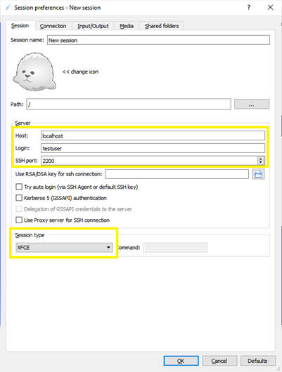
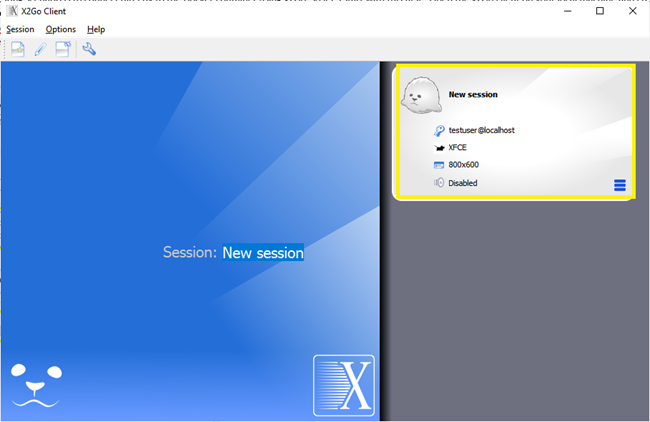

# Introduction

This sample walks through the high-level steps for configuring a lab that runs a Fedora Docker container on the student’s lab VM.

## Directions

### Prepare the template VM

1. [Create your lab](https://docs.microsoft.com/azure/lab-services/classroom-labs/how-to-manage-classroom-labs#create-a-classroom-lab) – in this example, let’s use the following settings:

    - Medium compute size (4 Cores, 8 GB RAM)
    - Ubuntu Server 16.04 LTS

1. Once the lab is created, connect to the template VM using SSH.  
1. Then, install [Docker engine](https://docs.docker.com/engine/install/) which is used to run and manage Docker containers on the VM.  For this sample, you should follow the instructions for [installing the latest version of the Docker engine on Ubuntu](https://docs.docker.com/engine/install/ubuntu/#install-using-the-repository).

### Build a custom Docker Fedora image

With Docker, you can use prebuilt images provided by Docker Hub and other container registries; or you can create your own custom container images.  In this sample, we’ll build our own custom container image that:

- Is based on the latest version of the [official Docker container image for Fedora](https://hub.docker.com/_/fedora).
- Installs SSH server package.
- Installs GUI packages for X2Go and XFCE desktop.
  
Here are steps to build our custom Fedora container image.  These instructions assume that you are still connected to the template VM using SSH:

1. Download the [Dockerfile](https://docs.docker.com/engine/reference/builder/) and [entrypoint.sh](https://docs.docker.com/engine/reference/builder/#entrypoint).

    ```bash
    curl -O https://raw.githubusercontent.com/Azure/LabServices/main/ClassTypes/Bash/FedoraDockerContainer/Dockerfile -O https://raw.githubusercontent.com/Azure/LabServices/main/ClassTypes/Bash/FedoraDockerContainer/entrypoint.sh
    ```

    In this sample, we’ll assume these files have been copied to a directory called **docker_fedora**:

    

    The Dockerfile is required to build the image and the entrypoint.sh script is executed when the container runs.  Also, notice that in the entrypoint.sh file, we have configured the credentials that you will use in later steps to connect using SSH and the GUI remote desktop:

    - **login**: testuser
    - **password**: Fedora#123

2. Next, we’ll need to change permissions on the entrypoint.sh file to ensure that it is executable (otherwise you will see a permission denied error when we try to run the container).  Do this by running the following command:

    ```bash
    sudo chmod +x entrypoint.sh
    ```

    > [!IMPORTANT]
    > If you inadvertently skip this step, you will receive the following error when you attempt to run the container later on in the steps.
    >
    >docker: Error response from daemon: OCI runtime create failed: container_linux.go:349: starting container process caused "exec: \"/entrypoint.sh\": permission denied": unknown.`
    >
    >To correct this, you’ll need to change the permissions as shown above and rebuild the Fedora container image.

3. Build the custom Fedora container image by running the following command.  This will take several minutes to run since it will pull all the necessary packages to the template VM.  Also, ensure that the ‘.’ is included at the end of the command:

    ```bash
    sudo docker build --rm -t customfedora .
    ```

4. When the build is done, use the following command to verify that you have a Docker container image called **customfedora**:

    ```bash
    sudo docker images
     ```

    

### Create and run a Docker container using the custom image

1. To run the container with the custom image that we created in the previous step, execute the following command:

    ```bash
    sudo docker run --name fedora_container --restart always -d -p 2200:22 customfedora
    ```

    > [!NOTE]
    > The restart parameter is used to automatically restart the container whenever the container is stopped.  This will ensure that the container restarts whenever a student stops\starts their VM.

1. Use the following command to verify that you have a running Docker container called **fedora_container** that forwards SSH port 22 on the Docker container to port 2200 on the host VM:

    ```bash
    sudo docker ps
    ```

    

### Connect from your local computer directly to the Docker container

To connect directly from your local computer to the Docker container, you need to complete the following steps on your local computer.  These are the same steps that students would need to follow to connect from their local computer to the Fedora Docker container running on their lab VM:

#### Install a remote desktop client

First, you need to install a remote desktop client on the local computer.  The remote desktop client is used to connect to the GUI desktop of the Fedora Docker container.  For this sample, we'll use [X2Go](https://github.com/Azure/LabServices/tree/main/TemplateManagement/Bash/LinuxGraphicalDesktopSetup).

#### Create an SSH tunnel

Next, you need to create an SSH tunnel between your local computer and the template VM (or student VM):

1. Ensure the VM is started.
1. Copy the SSH connection string for your template VM (or student VM).  Your connection string will look similar to this:

    ```bash
    ssh -p 12345 testuser@ml-lab-00000000-0000-0000-0000-000000000000.centralus.cloudapp.azure.com
    ```

1. On your local computer, open a terminal or command prompt.  Paste the SSH connection string and add **-L 2200:localhost:2200** into the command string, which creates a “tunnel” between your local computer and the template VM (or student VM).  The final command string should look like this:

    ``` bash
    ssh -p 12345 -L 2200:localhost:2200 testuser@ml-lab-00000000-0000-0000-0000-000000000000.centralus.cloudapp.azure.com
    ```

    Hit **Enter** to run the command.  When prompted, provide your password to the template VM.  At this point, the tunnel should now be established.  Leave this command window open.

    > [!IMPORTANT]
    >If you receive the following message, specify **yes** to continue.
    >
    > The authenticity of host '[ml-lab-00000000-0000-0000-0000-000000000000.central.cloudapp.azure.com]:12345 ([52.191.16.234]:12345)' can't be established.
    ECDSA key fingerprint is SHA256:46MUVWAZ+gKvzUuReiIpfZrrlXACqL+6hrelT8UNT9U.
    Are you sure you want to continue connecting (yes/no)?" then the password.

#### Connect to the Docker container using X2Go and SSH

1. Open the X2Go client on your local computer and create a new session using the following settings:

    - **Host**: localhost
    - **Login**: testuser
    - **SSH port**: 2200
    - **Session type**: XFCE

    

1. Click **OK** to create the session.  Next, click on your session in the right-hand pane.

    

1. When prompted, enter the credentials to connect to the Docker container and click **OK** to start the GUI desktop session.  Remember that the credentials are based on what we configured in the entrypoint.sh file:

   - **login**: testuser
   - **password**: Fedora#123

    

1. Finally, you should now be connected to Fedora's GUI Desktop:

    > [!IMPORTANT]
    >If you receive the following message, specify **yes** to continue.
    >
    >The server is unknown. Do you trust the host key? Public key hash: localhost:2200 - 7b:34:xxxxxx Yes/No

    

    After following the above steps to set up your template VM, you can then publish your lab.  Students will be able to directly connect to the Fedora Docker container on their assigned VM by creating the SSH tunnel and then using a GUI desktop client, such as X2Go.  To do this, students will also need to follow the steps outlined above on their local computer.

1. Remember to stop your VM when you are done.
